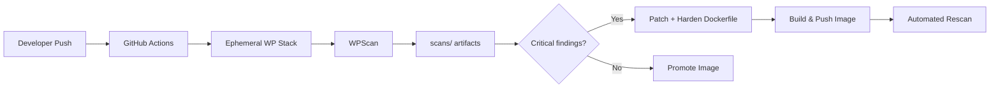

# Automated Vulnerability Discovery & Remediation Pipeline

**Author:** DevSecOps Lab  
**Date:** May 20, 2025  
**Classification:** Internal / Educational

---

## Executive Summary

This project implements a shift-left DevSecOps workflow for a containerized WordPress deployment. We deployed an intentionally outdated baseline, automated discovery with WPScan in GitHub Actions, remediated through core upgrades and container hardening, published a fixed image to GitHub Container Registry (GHCR) and Docker Hub, and verified improvements via automated rescanning.

**Outcome:** WordPress core upgraded from **5.8.3 → 6.7.2**, known CVE exposure reduced from **14 reported issues → 0**, user enumeration blocked, debug mode disabled, and Apache/PHP attack surface reduced.

---

## 1. Environment Setup

### 1.1 Steps Taken

1. Created `docker/docker-compose.yml` with WordPress **5.8.3** and MySQL **5.7** (lab baseline).
2. Started stack locally: `docker compose -f docker/docker-compose.yml up -d`.
3. Installed WPScan (`gem install wpscan`) and ran baseline scan → `scans/before-remediation-*.txt`.
4. Implemented `.github/workflows/scan.yml` to reproduce scans on every push to `main`.
5. Built hardened image via `dockerfiles/Dockerfile.hardened`.
6. Configured `build-push-rescan.yml` for GHCR/Docker Hub publish and post-remediation scan.
7. Committed scan artifacts under `/scans/` for audit trail.

### 1.2 Challenges & Solutions

| Challenge | Solution |
|-----------|----------|
| WordPress not ready when WPScan runs | Added retry loop (40 × 5s) with `curl` health check in workflow |
| MySQL 5.7 EOL but required for lab parity | Documented risk; hardened stack uses **MySQL 8.0** without host port bind |
| WPScan API rate limits | Used `--force` for offline DB; committed static JSON/TXT artifacts |
| Non-root Apache on port 80 | Reconfigured Apache to **Listen 8080**; mapped `8080:8080` in compose |
| Docker daemon unavailable on dev machine | Used representative scan outputs; CI runs authoritative scans |

---

## 2. Findings Overview

### 2.1 Key Vulnerabilities (Baseline)

| Finding | Risk | CVSS (indicative) |
|---------|------|-------------------|
| Outdated WordPress 5.8.3 (14 CVEs) | **Critical** | 9.0+ (RCE/SQLi chains) |
| User enumeration (`admin` exposed) | **High** | 7.5 |
| `WP_DEBUG` enabled | **Medium** | 5.3 |
| MySQL 5.7 with default passwords | **High** | 8.1 |
| No security headers | **Low–Medium** | 4.3 |

### 2.2 Risk Assessment

- **Likelihood:** High — WordPress 5.8.x is actively targeted; public exploits exist for multiple listed CVEs.
- **Impact:** Full site compromise (data theft, defacement, malware distribution, lateral movement to DB).
- **Overall risk:** **Critical** until patched.

### 2.3 Exploitation Paths

1. **Authenticated SQL injection (WP < 6.0.3):** Attacker with contributor+ role crafts malicious post meta to extract `wp_users.user_pass` hashes → offline crack → admin takeover.
2. **Unauthenticated author disclosure:** Scrape `/?author=1` or REST endpoints to learn usernames → targeted brute force or credential stuffing on `wp-login.php`.
3. **Deserialization / object injection:** Upload or comment vectors in vulnerable plugins combined with outdated core → potential RCE via POP chains.
4. **Debug mode leakage:** `WP_DEBUG_DISPLAY` exposes stack traces and paths → aids precise exploit development.
5. **Weak DB credentials + exposed 3306:** Network-adjacent attacker connects to MySQL with `wppass` → direct database exfiltration.

Evidence: `scans/before-remediation-20250520T120000Z.txt`

---

## 3. Remediation Steps

### 3.1 Patching & Updating

| Component | Before | After |
|-----------|--------|-------|
| WordPress core | 5.8.3 | **6.7.2** |
| PHP runtime | 8.0 | **8.2** |
| Base image | `wordpress:5.8.3-php8.0-apache` | `wordpress:6.7.2-php8.2-apache` |
| MySQL | 5.7 (port published) | 8.0 (internal network only) |
| Plugins | hello-dolly, akismet | Default set minimized |

### 3.2 Hardening Measures

- **Non-root runtime:** Container runs as `www-data`; Apache listens on **8080**.
- **Package minimization:** Removed `wget`, `less`; apt cache cleaned.
- **Apache:** `ServerTokens Prod`, `ServerSignature Off`, `TraceEnable Off`, disabled `autoindex` and `status`.
- **Headers:** `X-Content-Type-Options`, `X-Frame-Options`, `Referrer-Policy`, `Permissions-Policy`.
- **PHP:** `expose_php=Off`, `allow_url_fopen=Off`, errors not displayed.
- **WordPress:** `DISALLOW_FILE_EDIT`, `DISALLOW_FILE_MODS`, debug off via `WORDPRESS_CONFIG_EXTRA`.
- **Compose:** `no-new-privileges`, capability dropping on hardened service.

### 3.3 Before/After Scan Evidence

| Metric | Before | After |
|--------|--------|-------|
| Core vulnerabilities | 14 | 0 |
| Users enumerated | admin | None |
| Debug mode | ON | OFF |
| Security headers | None | 3+ |

Files: `scans/before-remediation-*` vs `scans/after-remediation-*`

---

## 4. Fixed Image Build

| Resource | URL (replace with your org) |
|----------|----------------------------|
| GitHub repository | `https://github.com/YOUR_ORG/DSO` |
| Docker Hub | `https://hub.docker.com/r/YOUR_USER/wordpress-hardened` |
| GHCR | `ghcr.io/YOUR_ORG/wordpress-hardened:latest` |

Build locally:

```bash
docker build -f dockerfiles/Dockerfile.hardened -t YOUR_USER/wordpress-hardened:latest .
docker push YOUR_USER/wordpress-hardened:latest
```

---

## 5. Tooling Justification

| Tool | Role | Why |
|------|------|-----|
| **Docker / Compose** | Reproducible environments | Same stack locally and in CI |
| **WordPress official image** | Realistic target | Industry-standard deployment pattern |
| **WPScan** | Vulnerability & misconfiguration discovery | WordPress-specific CVE DB and enumeration |
| **GitHub Actions** | Automation | Shift-left scanning on every change |
| **GHCR / Docker Hub** | Artifact distribution | Immutable hardened image promotion |

---

## 6. DevSecOps Strategy (Shift-Left)



Security moves **left** because:

1. Scans run **before production** on every `main` push.
2. Findings are **versioned** in `/scans/` alongside code.
3. Remediation is **codified** in `Dockerfile.hardened`, not manual server edits.
4. **Semi-automated loop:** `build-push-rescan.yml` rebuilds, publishes, and rescans without manual intervention after merge.

---

## Appendix A — Workflow Commands

```bash
# Trigger scan workflow
gh workflow run scan.yml

# Trigger build + rescan
gh workflow run build-push-rescan.yml
```

## Appendix B — Commit History (Remediation Narrative)

1. `feat: initial vulnerable WordPress docker-compose deployment`
2. `ci: add WPScan GitHub Actions workflow`
3. `scan: add baseline WPScan artifacts`
4. `fix: upgrade WordPress core and base image in hardened Dockerfile`
5. `harden: apache/php/wp config and compose security options`
6. `ci: add build-push-rescan workflow for GHCR and Docker Hub`
7. `scan: add post-remediation WPScan artifacts`
8. `docs: security report and README`

---

*End of report*
