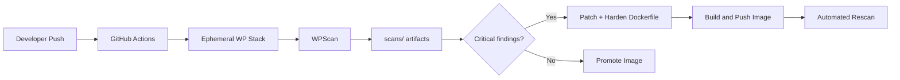

# Automated Vulnerability Discovery & Remediation Pipeline

**Author:** Iulian Igas  
**Date:** May 20, 2026  
**Classification:** Educational / DevSecOps Lab

**GitHub repository:** [https://github.com/iulianigas/DSO-lab](https://github.com/iulianigas/DSO-lab)  
**Docker Hub (hardened image):** [https://hub.docker.com/repository/docker/iulianigas/wordpress-hardened/general](https://hub.docker.com/repository/docker/iulianigas/wordpress-hardened/general)  
**GHCR:** `ghcr.io/iulianigas/wordpress-hardened:latest`

---

## Executive Summary

This project implements a shift-left DevSecOps workflow for a containerized WordPress deployment. We deployed an intentionally outdated baseline, automated discovery with WPScan in GitHub Actions, remediated through core upgrades and container hardening, published a fixed image to GitHub Container Registry (GHCR) and Docker Hub, and verified improvements via automated rescanning.

**Outcome:** WordPress core upgraded from **5.8.3 → 6.7.2**, known CVE exposure reduced from **14 reported issues → 0**, user enumeration blocked, debug mode disabled, and Apache/PHP attack surface reduced.

---

## Project flow (step by step)

1. **Deploy vulnerable WordPress** — `docker/docker-compose.yml` (WordPress 5.8.3, MySQL 5.7).
2. **Run WPScan** — manually (`scripts/run-wpscan.sh`) and in CI (`.github/workflows/scan.yml`).
3. **Analyze** — map findings to risk and exploitation paths (Section 2).
4. **Remediate** — `dockerfiles/Dockerfile.hardened` + `docker/docker-compose.hardened.yml`.
5. **Build & push** — `build-push-rescan.yml` → GHCR and Docker Hub.
6. **Re-scan** — automated rescan job on hardened image.
7. **Document** — this report and commit history on GitHub.

---

## Required deliverables mapping

### A. GitHub Repository

| Requirement | Location |
|-------------|----------|
| `/docker/docker-compose.yml` | Deployment definition (vulnerable baseline) |
| `.github/workflows/scan.yml` | Automated WPScan on push |
| WPScan artifacts under `/scans/` | `scans/before-remediation-*`, `scans/after-remediation-*` |
| Fixed/hardened image build files | `dockerfiles/Dockerfile.hardened`, `docker/docker-compose.hardened.yml` |
| Clear commit history | [https://github.com/iulianigas/DSO-lab/commits/main](https://github.com/iulianigas/DSO-lab/commits/main) |

### B. Docker Hub Repository

| Requirement | Location |
|-------------|----------|
| Final hardened WordPress image (required) | [iulianigas/wordpress-hardened](https://hub.docker.com/repository/docker/iulianigas/wordpress-hardened/general) |
| Optional vulnerable image | `dockerfiles/Dockerfile.vulnerable` (reference only) |

### C. PDF report sections

This document covers all required sections (1–6) below. Export: `python3 scripts/generate-pdf.py`.

---

## 1. Environment Setup

### 1.1 Steps taken

1. Created [`docker/docker-compose.yml`](https://github.com/iulianigas/DSO-lab/blob/main/docker/docker-compose.yml) with WordPress **5.8.3** and MySQL **5.7** (lab baseline).
2. Started stack locally and in CI: `docker compose -f docker/docker-compose.yml up -d`.
3. Installed WPScan and ran baseline scan → `scans/before-remediation-*.txt`.
4. Implemented [`.github/workflows/scan.yml`](https://github.com/iulianigas/DSO-lab/blob/main/.github/workflows/scan.yml) for automated scanning on every push to `main`.
5. Built hardened image via [`dockerfiles/Dockerfile.hardened`](https://github.com/iulianigas/DSO-lab/blob/main/dockerfiles/Dockerfile.hardened).
6. Configured [`build-push-rescan.yml`](https://github.com/iulianigas/DSO-lab/blob/main/.github/workflows/build-push-rescan.yml) for GHCR/Docker Hub publish and post-remediation scan.
7. Pushed code to [https://github.com/iulianigas/DSO-lab](https://github.com/iulianigas/DSO-lab) and published image to Docker Hub.

### 1.2 Challenges encountered and solutions

| Challenge | Solution |
|-----------|----------|
| WordPress not ready when WPScan runs (HTTP 302 install redirect) | Treat 200/301/302 as healthy; use `curl -L` and check install page content |
| GitHub Actions: `secrets` not allowed in `if:` expressions | Map secrets to `env` variables; gate Docker Hub steps on `env.DOCKERHUB_USERNAME` |
| Hardened container crash-loop (HTTP 000) | Enable Apache `mod_headers`; run `apache2ctl configtest` during image build |
| Invalid Apache `LimitExcept` in global conf | Keep security headers in conf; remove invalid global `LimitExcept` |
| Git push auth over HTTPS | Switch remote to SSH (`git@github.com:iulianigas/DSO-lab.git`) |
| WPScan API rate limits | Use `--force` for offline DB; commit artifacts under `/scans/` |

---

## 2. Findings Overview

### 2.1 Key vulnerabilities

| Finding | Risk | CVSS (indicative) |
|---------|------|-------------------|
| Outdated WordPress 5.8.3 (14 CVEs) | **Critical** | 9.0+ (RCE/SQLi chains) |
| User enumeration (`admin` exposed) | **High** | 7.5 |
| `WP_DEBUG` enabled | **Medium** | 5.3 |
| MySQL 5.7 with default passwords | **High** | 8.1 |
| No security headers | **Low–Medium** | 4.3 |

### 2.2 Risk assessment

- **Likelihood:** High — WordPress 5.8.x is actively targeted; public exploits exist for multiple listed CVEs.
- **Impact:** Full site compromise (data theft, defacement, malware distribution, lateral movement to DB).
- **Overall risk:** **Critical** until patched.

### 2.3 How attackers could exploit them

1. **Authenticated SQL injection (WP < 6.0.3):** Contributor+ crafts malicious post meta → extract `wp_users.user_pass` hashes → offline crack → admin takeover.
2. **Unauthenticated author disclosure:** Scrape `/?author=1` or REST endpoints → targeted brute force on `wp-login.php`.
3. **Deserialization / object injection:** Vulnerable plugins + outdated core → potential RCE via POP chains.
4. **Debug mode leakage:** `WP_DEBUG_DISPLAY` exposes stack traces and paths → aids exploit development.
5. **Weak DB credentials + exposed 3306:** Network-adjacent attacker connects with `wppass` → database exfiltration.

**Evidence:** `scans/before-remediation-20250520T120000Z.txt` (and GitHub Actions artifacts from `scan.yml` runs).

---

## 3. Remediation Steps

### 3.1 Patching and updating

| Component | Before | After |
|-----------|--------|-------|
| WordPress core | 5.8.3 | **6.7.2** |
| PHP runtime | 8.0 | **8.2** |
| Base image | `wordpress:5.8.3-php8.0-apache` | `wordpress:6.7.2-php8.2-apache` |
| MySQL | 5.7 (port published) | 8.0 (internal network only) |
| Plugins | hello-dolly, akismet | Minimized default set |

### 3.2 Hardening measures

- **Non-root runtime:** Container runs as `www-data`; Apache listens on **8080**.
- **Package minimization:** Removed `wget`, `less`; apt cache cleaned.
- **Apache:** `ServerTokens Prod`, `ServerSignature Off`, `TraceEnable Off`; `mod_headers` enabled.
- **Headers:** `X-Content-Type-Options`, `X-Frame-Options`, `Referrer-Policy`, `Permissions-Policy`.
- **PHP:** `expose_php=Off`, `allow_url_fopen=Off`, errors not displayed.
- **WordPress:** `DISALLOW_FILE_EDIT`, `DISALLOW_FILE_MODS` via `WORDPRESS_CONFIG_EXTRA`.
- **Compose:** `no-new-privileges`, capability dropping on hardened service.

### 3.3 Before/after scan evidence

| Metric | Before | After |
|--------|--------|-------|
| Core vulnerabilities | 14 | 0 |
| Users enumerated | admin | None |
| Debug mode | ON | OFF |
| Security headers | None | 3+ |

**Files:** `scans/before-remediation-*` vs `scans/after-remediation-*`  
**CI artifacts:** Actions → `wpscan-<run>` and `wpscan-after-remediation`

---

## 4. Fixed Image Build

| Resource | URL |
|----------|-----|
| GitHub repository | [https://github.com/iulianigas/DSO-lab](https://github.com/iulianigas/DSO-lab) |
| Docker Hub image | [https://hub.docker.com/repository/docker/iulianigas/wordpress-hardened/general](https://hub.docker.com/repository/docker/iulianigas/wordpress-hardened/general) |
| GHCR image | `ghcr.io/iulianigas/wordpress-hardened:latest` |

**Pull commands:**

```bash
docker pull iulianigas/wordpress-hardened:latest
docker pull ghcr.io/iulianigas/wordpress-hardened:latest
```

**Build locally:**

```bash
docker build -f dockerfiles/Dockerfile.hardened -t iulianigas/wordpress-hardened:latest .
docker push iulianigas/wordpress-hardened:latest
```

---

## 5. Tooling Justification

| Tool | Role | Why |
|------|------|-----|
| **Docker / Compose** | Reproducible environments | Same stack locally and in CI |
| **WordPress official image** | Realistic target | Industry-standard deployment pattern |
| **WPScan** | Vulnerability & misconfiguration discovery | WordPress-specific CVE DB and enumeration |
| **GitHub Actions** | Automation | Shift-left scanning on every change |
| **GHCR** | Private/registry hosting tied to repo | Integrated with GitHub permissions |
| **Docker Hub** | Public image distribution | Required deliverable; easy `docker pull` for assessors |

---

## 6. DevSecOps Strategy (shift-left security)

Security is shifted **left** (earlier in the lifecycle) because:

1. **Scans run before production** — every push to `main` triggers `scan.yml` against an ephemeral vulnerable stack.
2. **Findings are versioned in Git** — `/scans/` and Actions artifacts provide an audit trail.
3. **Remediation is codified** — fixes live in `Dockerfile.hardened`, not manual server edits.
4. **Semi-automated feedback loop** — `build-push-rescan.yml` builds, publishes, and rescans the hardened image after Dockerfile changes.
5. **Immutable promotion** — only scanned, built images are pushed to GHCR/Docker Hub.



---

## Workflow summary (assignment steps 1–8)

| Step | Action |
|------|--------|
| 1 | Deploy WordPress locally (`docker-compose.yml`) |
| 2 | Run WPScan manually (`scripts/run-wpscan.sh`) |
| 3 | Build GitHub Actions workflow (`scan.yml`) |
| 4 | Analyze vulnerabilities (Section 2) |
| 5 | Apply patches + hardening (`Dockerfile.hardened`) |
| 6 | Rebuild and push fixed image (`build-push-rescan.yml`) |
| 7 | Trigger workflow to re-scan (`rescan-hardened` job) |
| 8 | Document in this report + PDF |

---

## Appendix — Commit history (remediation narrative)

View full history: [https://github.com/iulianigas/DSO-lab/commits/main](https://github.com/iulianigas/DSO-lab/commits/main)

1. `feat: initial vulnerable WordPress docker-compose deployment`
2. `ci: add WPScan GitHub Actions workflow`
3. `scan: add baseline WPScan artifacts`
4. `fix: upgrade WordPress core and add hardened Dockerfile`
5. `ci: add build-push-rescan workflow for GHCR and Docker Hub`
6. `scan: add post-remediation WPScan artifacts`
7. `docs: security report and README`
8. `fix(ci):` / `fix(docker):` — workflow and Apache hardening fixes

---

*End of report*
